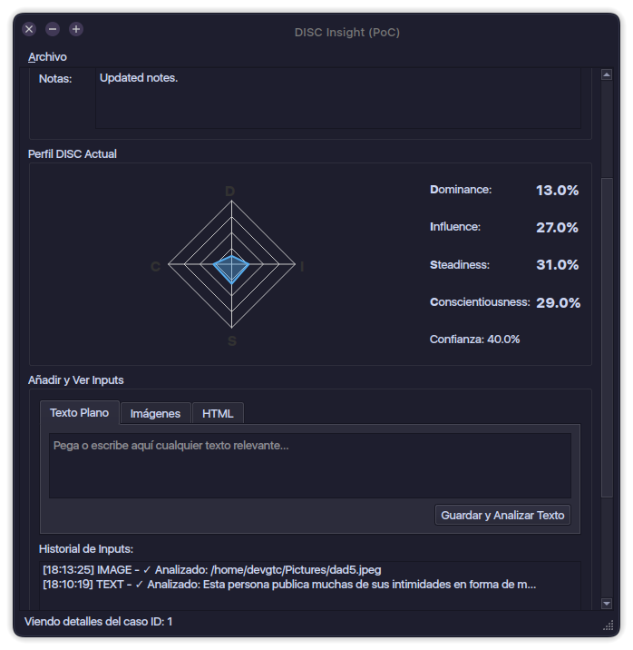

# DISC Insight (Prueba de Concepto)



**DISC Insight** es una aplicación de escritorio diseñada para analizar y gestionar perfiles de personalidad DISC. Utilizando el poder de los modelos de lenguaje a gran escala (LLMs) a través de la API de Gemini, la aplicación permite a los usuarios crear perfiles detallados a partir de diversas fuentes de datos, como texto plano, imágenes y perfiles de redes sociales.

El objetivo de esta Prueba de Concepto (PoC) es demostrar la viabilidad de un sistema que no solo recopila y analiza datos, sino que también ofrece estrategias de comunicación y acción personalizadas, actuando como un coach de inteligencia interpersonal.

---

## 🚀 Características Principales

*   **Gestión de Casos**: Crea, edita y organiza perfiles individuales para cada persona que desees analizar.
*   **Análisis Multi-fuente**: Ingresa datos a través de:
    *   **Texto Plano**: Notas de reuniones, correos electrónicos, biografías.
    *   **Imágenes**: Fotos de rostros, posturas o entornos para un análisis visual.
    *   **HTML**: Perfiles de redes sociales (ej. LinkedIn) para analizar la comunicación pública.
*   **Integración con IA (Gemini)**: Cada pieza de información se envía a la API de Gemini para obtener un análisis interpretativo y una evaluación DISC inicial.
*   **Perfil DISC Consolidado**: El sistema fusiona inteligentemente múltiples análisis, ponderando cada tipo de input, para generar un perfil DISC consolidado y un nivel de confianza.
*   **Visualización de Datos**: Un gráfico de radar intuitivo muestra el perfil DISC (Dominancia, Influencia, Estabilidad, Conciencia) de un vistazo.
*   **Estrategias Inteligentes**:
    *   Define objetivos específicos para cada caso (ej. "Vender un curso", "Mejorar la colaboración").
    *   Registra interacciones y resultados.
    *   Solicita a la IA sugerencias y mejoras para tu estrategia, basadas en el perfil DISC de la persona y el historial de interacciones.
*   **Exportación de Datos**: Exporta el perfil completo de un caso (datos, análisis y estrategias) a un archivo JSON para su uso en otras aplicaciones o para realizar copias de seguridad.

---

## 🛠️ Tecnologías Utilizadas

*   **Lenguaje**: Python 3.12+
*   **Framework de UI**: PySide6 (las vinculaciones oficiales de Qt para Python)
*   **Base de Datos**: SQLite (para almacenamiento local y portable)
*   **IA / LLM**: Google Gemini API (`google-generativeai`)
*   **Manejo de Imágenes**: Pillow

---

## ⚙️ Instalación y Ejecución

Sigue estos pasos para poner en marcha la aplicación en tu máquina local.

### 1. Prerrequisitos

*   Python 3.12 o superior.
*   `pip` (el gestor de paquetes de Python).
*   Una **API Key de Google Gemini**. Puedes obtener una de forma gratuita en [Google AI Studio](https://aistudio.google.com/app/apikey).

### 2. Clonar el Repositorio

```bash
git clone https://github.com/tu-usuario/disc-insight.git
cd disc-insight
```

### 3. Instalar Dependencias

Se recomienda utilizar un entorno virtual para mantener las dependencias aisladas.

```bash
# Crear un entorno virtual
python -m venv venv

# Activar el entorno virtual
# En Windows:
venv\Scripts\activate
# En macOS/Linux:
source venv/bin/activate

# Instalar las librerías requeridas
pip install -r requirements.txt
```

### 4. Configurar la Base de Datos

El proyecto incluye un script para inicializar la base de datos SQLite.

```bash
python database/database_setup.py
```
Este comando creará el archivo `database/disc_insight.db` con todas las tablas necesarias.

### 5. Configurar la Aplicación

*   Ejecuta la aplicación por primera vez:
    ```bash
    python main.py
    ```
*   Ve al menú **Archivo -> Configuración...**.
*   Pega tu **API Key de Google Gemini** en el campo correspondiente.
*   Haz clic en "Save".

### 6. ¡Listo para Usar!

¡La aplicación ya está configurada! Puedes empezar a crear casos, añadir inputs y explorar las funcionalidades.

---

## 📂 Estructura del Proyecto

```
disc-insight/
│
├── app/                  # Directorio principal del código fuente
│   ├── core/             # Lógica de negocio, acceso a BD, cliente API
│   │   ├── database_manager.py
│   │   ├── gemini_client.py
│   │   └── disc_analyzer.py
│   └── ui/               # Componentes de la interfaz (ventanas, widgets)
│       ├── main_window.py
│       ├── case_list_widget.py
│       └── ...
│
├── database/             # Scripts y archivo de la base de datos
│   ├── database_setup.py
│   └── disc_insight.db   (creado tras la ejecución del setup)
│
├── main.py               # Punto de entrada de la aplicación
├── README.md             # Este archivo
└── requirements.txt      # Dependencias del proyecto
```

---

## ⚖️ Licencia

Este proyecto es una Prueba de Concepto y se distribuye bajo la Licencia MIT. Consulta el archivo `LICENSE` para más detalles.

---

*Desarrollado con la ayuda de un asistente de IA.*
